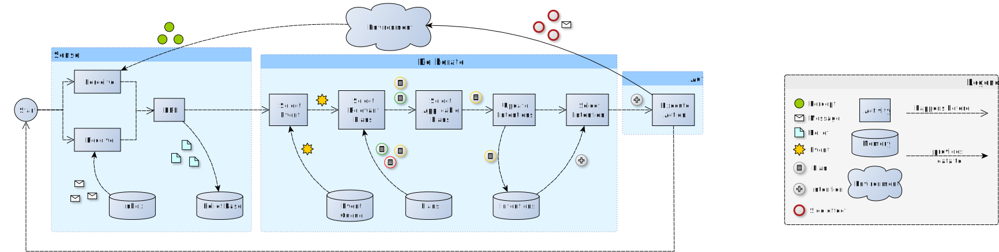
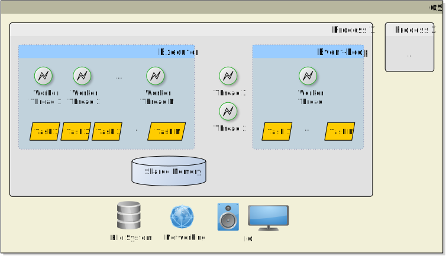
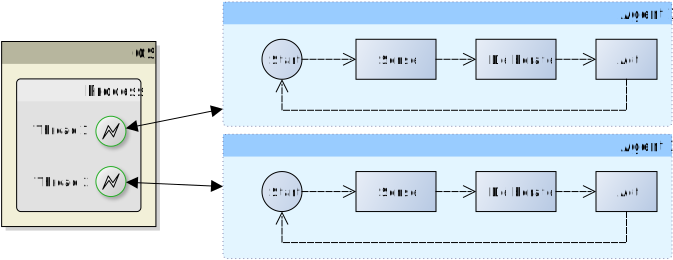
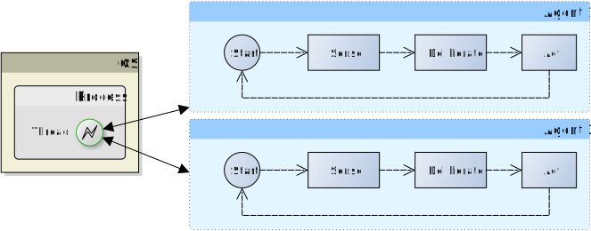
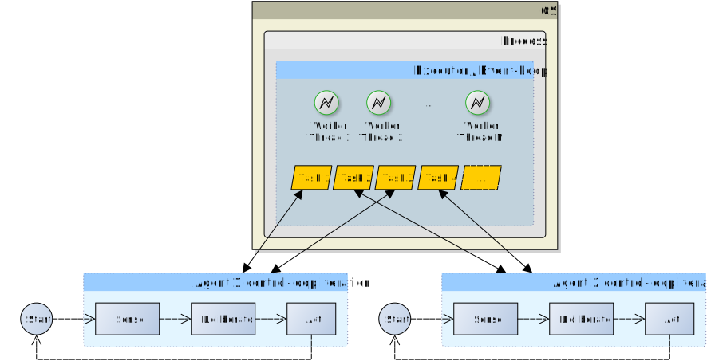
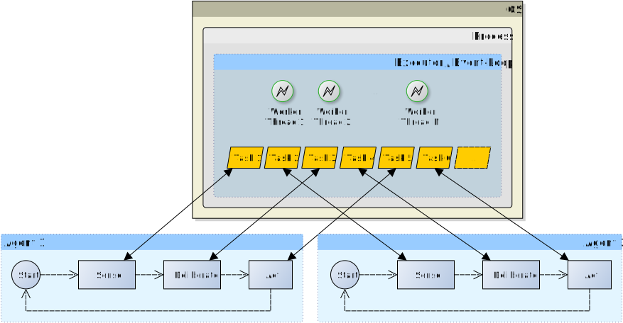
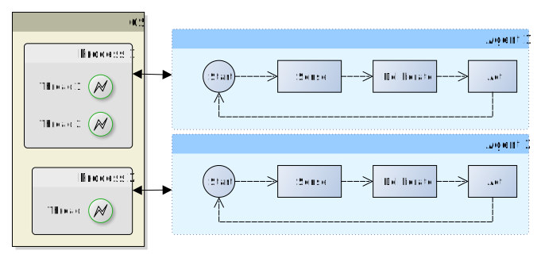

+++
title = "On the external concurrency of current BDI frameworks for MAS"
outputs = ["Reveal"]
+++

# On the external concurrency 
# of current BDI frameworks for MAS

<br>

Martina Baiardi, Samuele Burattini, Giovanni Ciatto <br />
Danilo Pianini, **Alessandro Ricci**, and Andrea Omicini

<small>Department of Computer Science and Engineering (DISI)<br>
Alma Mater Studiorum — Università di Bologna <br>
Via dell’Università 50, 47522 Cesena (FC), Italy </small>

---

<!-- ## BDI Agents

Architettura BDI -> mettiamo il puntino su qual è l'architettura di riferimento

Noi, a partire da questo, abbiamo fatto un nostro formalismo per descrivere la concorrenza, -->

# Context
## BDI Agents Programming


{}
{}

<div class="text-center">

- most famous semantics: __AgentSpeak(L)__

- most famous architecture (see picture)

- several implementations 
  - focus on: Astra, GOAL, Jadex, JaKtA, <br />Jason, PHIDIAS, SPADE-BDI

</div>

{}
{}

<div class="text-center">


</div>

{}
{}

---

## Motivation

> Insight: _the same architecture may be implemented in so many ways_
> <br> (e.g., w.r.t. __concurrency__)
- semantics _unaffected_
- impact on practical properties such as __efficiency__ & __reproducibility__

### Goals

1. Devise concurrency patterns from the state-of-the-practice
2. Classify BDI technologies accordingly

---

<!-- ## Computational Autonomy
<br>

- **Computational autonomy** is a pre-requisite for **autonomy** in software agents
- Agent's control-flow &rarr; mainstream programming languages concurrency abstractions <br> (e.g., thread, process, ...)  -->

## Background

- Agents lifecycle, in general, is a control-loop
  + __sense__, _then_ __deliberate__, _then_ __act__, repeat

- BDI agents are more _complex_
  * e.g. sense implies collecting percepts, revising beliefs, etc.
  * e.g. deliberate implies selecting plans, updating intentions, etc.



---

## Which concurrency?

We distinguish between **internal** and **external** concurrency

<!-- {}
{} 

<div class="text-center">

### Internal Concurrency

\begin{aligned}
Agent ::== Perceive \parallel Deliberate \parallel Act
\end{aligned}

\begin{aligned}
Perceive ::== (\verb|perceive|_1 \parallel \ldots \parallel \verb|perceive|_M) \cdot Sense
\end{aligned}

\begin{aligned}
Deliberate ::== (Deliberate_1 \parallel \ldots \parallel Deliberate_L) \cdot Deliberate
\end{aligned}

\begin{aligned}
Act ::== (Act_1 \parallel \ldots \parallel Act_K) \cdot Act
\end{aligned}

</div>

{}
{} 

<div class="text-center">

### External Concurrency

\begin{aligned}
Mas ::== Agent_1 \parallel \ldots \parallel Agent_N 
\end{aligned}

\begin{aligned}
Agent ::== \verb|sense| \cdot \verb|deliberate| \cdot \verb|act| \cdot Agent \\
\end{aligned}

</div>

{}
{} -->

> __Internal__ concurrency $\approx$ how agents schedule intentions internally

> __External__ concurrency  $\approx$ how agents' control-loops are scheduled by the underlying platform

---

## Which concurrency abstractions?
#### In practice, technological platforms support:

{}
{}

<div class="text-center">

- **Processes**
- **Threads**
- **Event Loops**
- **Executors**

</div>

{}
{}



{}
{}


---

## Common concurrency patterns for MAS


- **One-Agent-One-Thread** ( **1A1T** )
- **All-Agents-One-Thread** ( **AA1T** )
- **All-Agents-One-Event-Loop** ( **AA1EL** )
- **All-Agents-One-Executor** ( **AA1E** )
  - With a **fixed**-size thread pool
  - With a **variable**-size thread pool 

---

## One-Agent-One-Thread ( **1A1T** )



---

## All-Agents-One-Thread ( **AA1T** )



---

## All-Agents-One-Executor ( **AA1E** )

Allows for various level of __granularity__:

{}
{}



{}
{}



{}
{}

> Different properties w.r.t. **fixed** or **variable** amount of worker threads ($N$)

> All-Agents-One-Event-Loop (**AA1EL**) $\equiv$ AA1E with _just one thread_

---

## One-Agent-One-Process( **1A1P** )



---

## Which concurrency abstraction is the most appropriate?

- The selection of an appropriate concurrency model deeply impacts several aspects of the agent programming framework 
  - The **efficiency** of the MAS may improve, but
  <!-- TODO add example -->
  - **predictability** and **reproducibility** may be affected.
    <!-- TODO add example -->
- **Capturing and controlling concurrency is crucial, <br />and they often are hidden under the framework abstractions** 


---

## Analysis on BDI frameworks:


{}
{} 

<div class="text-center">

### Methodology

We inspected external concurrency in three steps:

1. **Empirical Evaluation** through a synthetic benchmark
2. **Documentation** and **source code inspection** of the selected BDI frameworks
3. **Direct contact** with maintainers

</div>

{}
{} 

<div class="text-center">

### Framework selection

We selected actively-maintained and open source BDI programming frameworks:
- **Astra**
- **GOAL**
- **Jadex**
- **JaKtA**
- **Jason**
- **PHIDIAS**
- **SPADE-BDI**

</div>

{}
{}

---

## Benchmark

{}
{} 

<div class="text-center">

### Agent: PINGER

```prolog
!ping.
+!ping <- 
    .revealCurrentThread("intention 1");
    .send(pong, tell, ball);
    !!showThread(2); /* Generates intention 2 */
    .revealCurrentThread("intention 1").
+ball <-
    !!showThread(4); /* Generates intention 4 */
    .revealCurrentThread("intention 3").
+!showThread(X) <- .revealCurrentThread("intention " + X).
```

</div>

{}
{} 

<div class="text-center">

### Agent: PONGER

```prolog
+ball[source(X)] <-
    .revealCurrentThread("intention 5");
    .send(X, tell, ball);
    !!showThread(6); /* Generates intention 6 */
    .revealCurrentThread("intention 5").
+!showThread(X) <- .revealCurrentThread("intention " + X).
```

</div>

{}
{}

---

## Results


| Model &rArr; <br /> Tech. &dArr; | **1A1T** | **AA1T** | **AA1EL** |  **AA1E** <br /> **fixed** | **AA1E** <br /> **variable** | **1A1P** |
| --- | --- | --- | --- | --- | --- | --- |
| **Astra** |   |    |   |   |   |   |  
| **Goal** |   |   |   |   |   |   |  
| **Jadex** |   |   |   |   |   |   |  
| **JaKtA** |   |   |   |   |   |   |  
| **Jason** |   |   |   |   |   |   |  
| **Phidias** |   |   |   |   |   |   |  
| **Spade-BDI** |   |   |   |   |   |   |  

<br>

#### Legend
-   $\equiv$ supported
-   $\equiv$ __not__ supported
-   $\equiv$ supported in principle, <br />but requires the user to implement it

---

## Discussion

> __Takeaway 1__: better for a BDI framework to support _multiple_ concurrency patterns

> __Takeaway 2__: even better for a BDI framework to support concurrency patterns _customisability_ on the __user-side__ 
+ supporting e.g. __comparing__ perfomance among different concurrency patterns, for the same MAS
+ supporting e.g. _prioritising_ __determinism__ over __efficiency__ (AA1T) for __testing__ 
+ supporting e.g. _prioritising_ __indipendence__ of control flows (1A1T) for __I/O-bound__ tasks 
 
---

## Conclusions

It is necessary to separate BDI architecture from its actual execution
 * **without impacting the architecture definition**
 * **without necessarily knowing how to program concurrency abstractions**
 * **choosing dynamically which concurrent execution suits the scenario**
